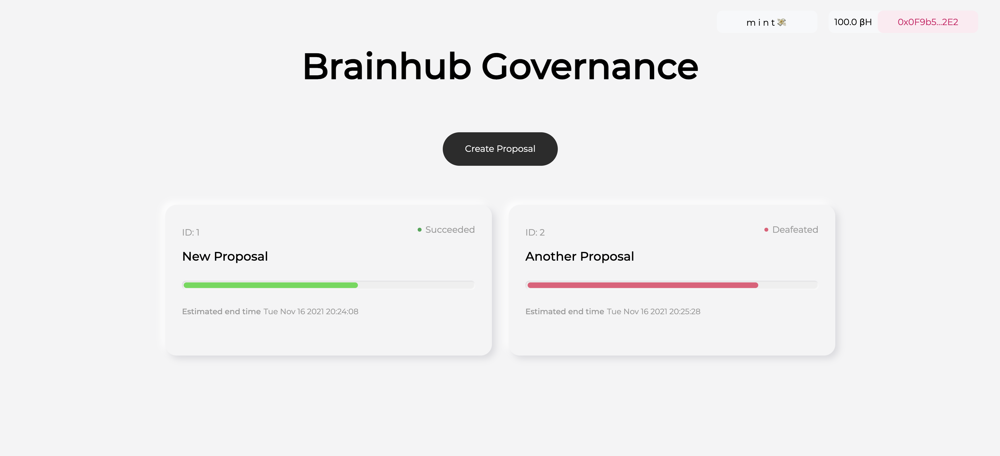
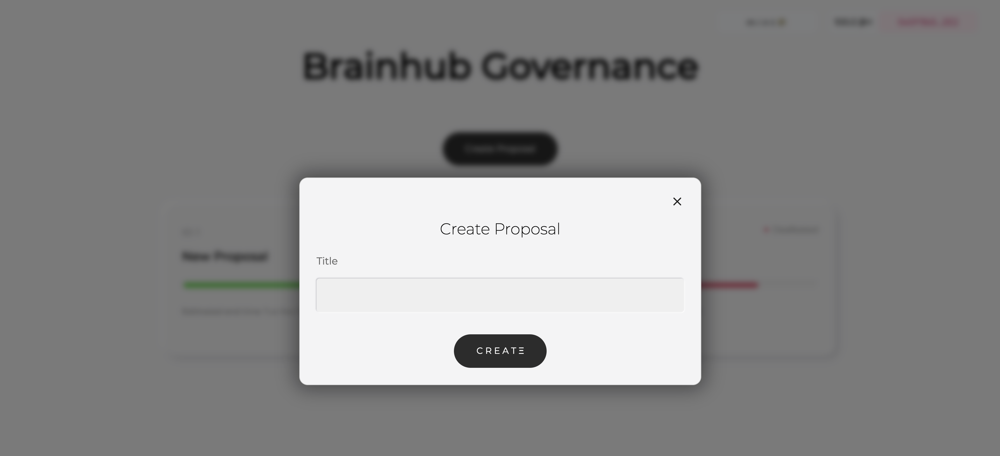
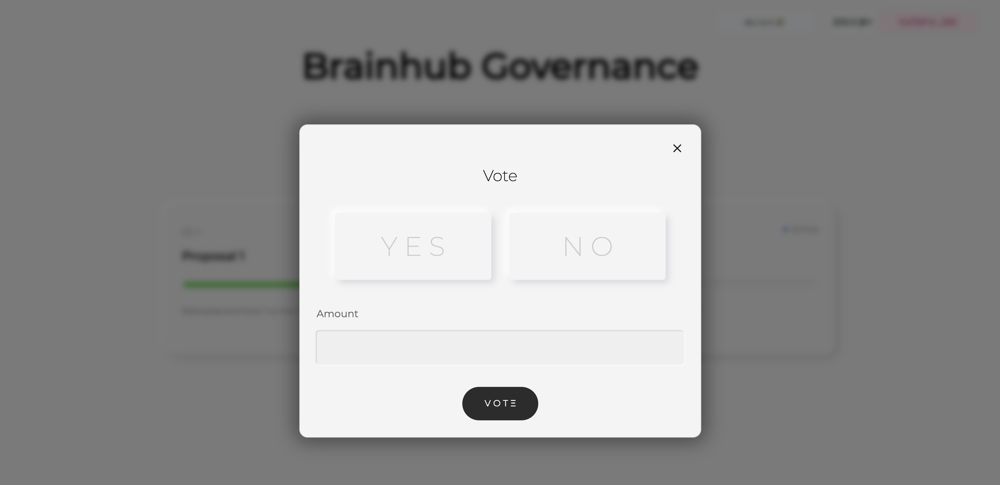

# Governance Protocol

## Features

- Mint governance tokens
- Create proposals
- Vote for proposals

## Technology stack

### Frontend

- React
- Typescript
- usedapp
- Ethers
- Typechain
- fp-ts
- io-ts
- ts-pattern

### Blockchain

- Ethereum
- Solidity
- Hardhat
